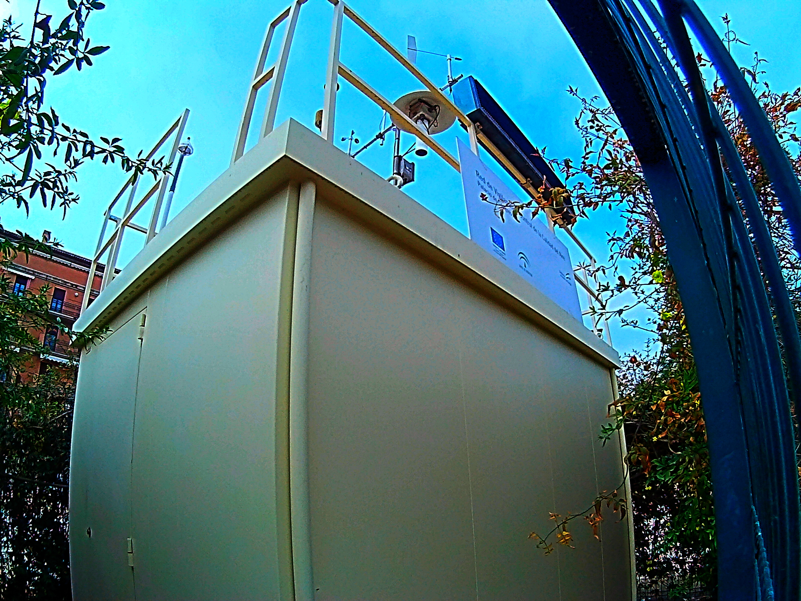

# Open Data Day Hackathón - Granada 2017

Este fue el [planteamiento inicial](planteamiento.md), con una serie
de proyectos. A continuación los resultados.

## Proyecto en Figshare

Un
[proyecto en Figshare](https://figshare.com/account/home#/projects/19567) reúne
diferentes conjuntos de datos extraídos. 

## Contaminación en las redes sociales

En en [subdirectorio `contacloud`](contacloud/) está el script para
analizar las redes sociales y crear una nube de palabras relacionadas
con la contaminación. Este es el resultado de diferentes días:

Subproyecto realizado por [Alex](https://github.com/PhoenixAlx)  
  
## Comparación gasoil-gasolina  
  
Normativa  
  
[Normativa europea sobre emisiones](https://es.wikipedia.org/wiki/Normativa_europea_sobre_emisiones)  

Consumos  
  
[Consumo energía final](https://fusiontables.google.com/embedviz?containerId=googft-gviz-canvas&q=select+col0%2C+col8%2C+col6+from+1aAd0hqZ_G0o7Wy15Jot-Errlo7O4WnJLu36Wpx2E+order+by+col0+asc&viz=GVIZ&t=AREA&rmax=250&uiversion=2&gco_forceIFrame=true&gco_hasLabelsColumn=true&width=500&height=300)  
  
[Parque móvil](https://fusiontables.google.com/embedviz?containerId=googft-gviz-canvas&q=select+col0%2C+col1%2C+col2+from+1_cxeeLyOKDwIAEToLtRzlguqn6Suf9O8DoCrogo8+order+by+col0+asc&viz=GVIZ&t=AREA&rmax=250&uiversion=2&gco_forceIFrame=true&gco_hasLabelsColumn=true&width=500&height=300)

## Estación meteorólgica en Twitter

[Fran Navarro](http://github.com/fnavales) ha creado una [cuenta
Twitter que envía resultados de sensores en su barrio recolectados con
un Arduino](https://twitter.com/tempChanaGR).

## Serie en el mes de Febrero

[Víctor Gea](http://github.com/VictorGeaGarcia) ha creado con pandas y
bokeh
[una visualización de la contaminación en la estación del Palacio de Congresos en febrero](Contaminacion_Congresos_febrero.html),
estación cuya foto aparece aquí:

## Módulo en Perl para *scraping*

[Web::SIVA](http://search.cpan.org/~jmerelo/Web-SIVA-0.0.4/) es un
módulo en Perl para extraer datos de la web en el formato web que se
usa a partir de 2004. 

