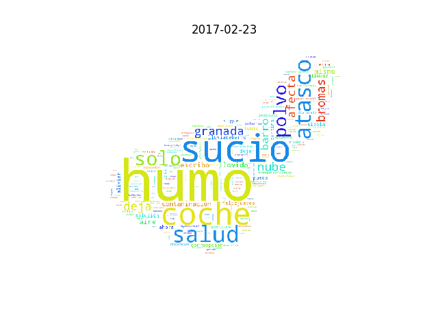

# Algunos resultados

## Contaminación en las redes sociales

En en [subdirectorio `contacloud`](contacloud/) está el script para
analizar las redes sociales y crear una nube de palabras relacionadas
con la contaminación. Este es el resultado de diferentes días:

Subproyecto realizado por [Alex](https://github.com/PhoenixAlx)  
  
## Comparación gasoil-gasolina  
  
Normativa  
  
[Normativa europea sobre emisiones](https://es.wikipedia.org/wiki/Normativa_europea_sobre_emisiones)  

Consumos  
  
[Consumo energía fina](https://fusiontables.google.com/embedviz?containerId=googft-gviz-canvas&q=select+col0%2C+col8%2C+col6+from+1aAd0hqZ_G0o7Wy15Jot-Errlo7O4WnJLu36Wpx2E+order+by+col0+asc&viz=GVIZ&t=AREA&rmax=250&uiversion=2&gco_forceIFrame=true&gco_hasLabelsColumn=true&width=500&height=300)  
  
[Parque movil](https://fusiontables.google.com/embedviz?containerId=googft-gviz-canvas&q=select+col0%2C+col1%2C+col2+from+1_cxeeLyOKDwIAEToLtRzlguqn6Suf9O8DoCrogo8+order+by+col0+asc&viz=GVIZ&t=AREA&rmax=250&uiversion=2&gco_forceIFrame=true&gco_hasLabelsColumn=true&width=500&height=300)
  

